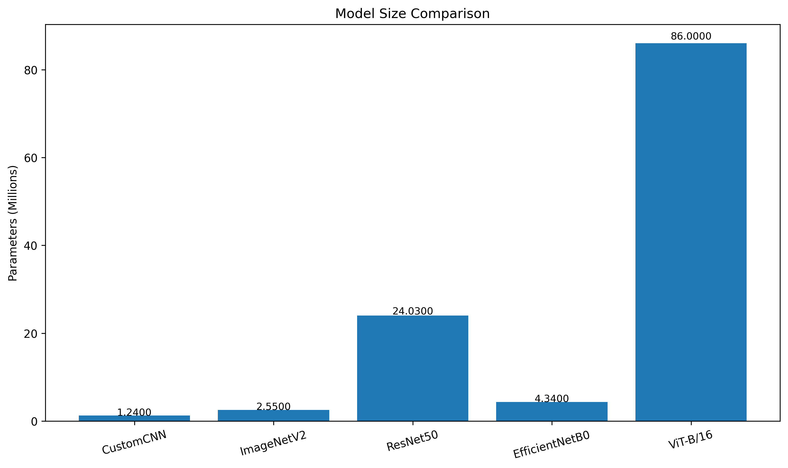

# Facial Emotion Recognition for Marketing & Customer Service

A deep learning system that detects human emotion from facial expressions in real time, built for use cases in marketing analytics and customer service quality monitoring. Five architectures were trained and benchmarked on the FER2013 dataset; the best-performing model (EfficientNetB0) is deployed in an interactive Gradio web app for live webcam and image-based inference.


---

## Table of Contents

- [Project Overview](#project-overview)
- [Problem Statement](#problem-statement)
- [Dataset](#dataset)
- [Approach](#approach)
- [Results](#results)
- [Ethical Considerations](#ethical-considerations)
- [Repository Structure](#repository-structure)
- [Installation](#installation)
- [Usage](#usage)
- [Skills Demonstrated](#skills-demonstrated)
- [Tech Stack](#tech-stack)
- [Team](#team)
- [References](#references)
- [License](#license)

---

## Project Overview

Every customer interaction — a frustrated support call, a delighted in-store shopper, a confused website visitor — carries emotional signals that directly shape purchasing behavior, brand loyalty, and churn. Traditional methods of capturing this (surveys, focus groups, manual review) are slow, expensive, and incomplete.

This project explores whether **computer vision can read those emotional signals automatically, objectively, and in real time**, closing the gap between what customers feel and what businesses can measure. We trained and rigorously compared five deep learning architectures on the FER2013 benchmark dataset, then packaged the best model into a deployable web application.

## Problem Statement

The project set out to answer three concrete questions:

1. **Model selection** — Among a lightweight custom CNN, a deep residual network, a mobile-optimized network, a vision transformer, and a compound-scaled efficient network, which architecture gives the best accuracy-to-cost trade-off for facial emotion recognition?
2. **Class imbalance** — FER2013 is heavily skewed (the *Happy* class makes up ~25% of samples while *Disgust* makes up only ~1.5%). How should training and evaluation be designed so the model doesn't just learn to predict the majority class?
3. **Deployability** — Can a model trained for benchmark accuracy be turned into a working, real-time tool that detects a face in an arbitrary image or webcam feed and classifies its emotion?

## Dataset

**[FER2013](https://www.kaggle.com/datasets/ananthu017/emotion-detection-fer)** (Facial Expression Recognition 2013)

| Property | Value |
|---|---|
| Total images | 35,887 |
| Training images | 28,709 (80%) |
| Test images | 7,178 (20%) |
| Resolution | 48 × 48 px, grayscale |
| Classes | 7 emotions: Angry, Disgusted, Fearful, Happy, Neutral, Sad, Surprised |
| Corrupted images | 0 |

**Key challenge:** severe class imbalance — *Happy* dominates at ~25% (8,989 samples) while *Disgust* is the minority class at just ~1.5% (547 samples). This directly shaped the training strategy (weighted sampling, class-weighted loss) and the choice of evaluation metric (weighted/macro F1 over raw accuracy).

## Approach

### Preprocessing pipeline
- **Upscaling:** 48×48 → 224×224 to match pretrained ImageNet input requirements
- **RGB conversion:** grayscale → 3-channel so ImageNet-pretrained backbones can be used
- **Normalization:** pixel values standardized to ImageNet mean/std for stable gradients
- **Augmentation:** random horizontal flip, rotation, affine transforms, and color jitter on the training set to improve generalization
- **Tensor mapping:** PyTorch `Dataset`/`DataLoader` pipeline for GPU-accelerated training

### Models compared

| Model | Rationale |
|---|---|
| **CustomCNN** | Built from scratch as a baseline, to quantify how much pretrained weights matter |
| **ResNet50** | Industry-standard benchmark using residual connections to train deep networks without vanishing gradients |
| **MobileNetV2** | Lightweight, mobile-optimized — best suited for resource-constrained, real-time deployment |
| **ViT-B/16** | Vision Transformer; splits images into 16×16 patches and uses self-attention instead of convolutions |
| **EfficientNetB0** | Achieves high accuracy with fewer parameters via compound scaling of depth, width, and resolution |

### Training methodology

All five models were trained under **identical conditions** for a fair comparison:

| Setting | Value | Reason |
|---|---|---|
| Batch size | 32 | Balances memory efficiency and gradient stability |
| Epochs | up to 30–35 | Sufficient given early stopping |
| Learning rate | staged (1e-3 → 1e-4 → 1e-5) | Standard progressive fine-tuning schedule |
| Random seed | 42 | Ensures reproducibility across all models |
| Early stopping patience | 5–8 epochs | Prevents overfitting, saves compute |
| Training strategy | 3-phase progressive unfreezing (head-only → partial backbone → full fine-tune) | Trains the new classifier head first, then gradually adapts pretrained features |
| Class imbalance handling | Weighted random sampler + class-weighted cross-entropy loss with label smoothing | Prevents the model from collapsing to the majority class |
| Cross-validation | 5-fold | Ensures reported metrics are averaged across different data splits |
| Mixed precision | Enabled (AMP + gradient scaling) | Faster training, lower memory footprint |
| Evaluation metric | Weighted F1 (primary), macro F1, accuracy | Weighted F1 chosen over raw accuracy due to class imbalance |

## Results

### Cross-validation comparison

EfficientNetB0 and ViT-B/16 consistently led across accuracy, weighted F1, and macro F1, while CustomCNN lagged well behind all pretrained models — confirming the value of transfer learning for this task.

| Model | Parameters | Notes |
|---|---|---|
| CustomCNN | 1.24M | Fastest to train, but lowest accuracy — pretrained features clearly matter |
| ViT-B/16 | 86M | Largest and slowest to train (~440 min); strong but not the top performer |
| **EfficientNetB0** | **~5M** | **Best overall accuracy-to-efficiency trade-off** |




### Final test set performance — EfficientNetB0 (winning model)

| Metric | Score |
|---|---|
| Accuracy | **70.19%** |
| Weighted F1 | **70.23%** |
| Macro F1 | **69.39%** |

EfficientNetB0 outperformed the much larger ViT-B/16 while using roughly **20× fewer parameters** — making it the clear choice for a real-time, deployable application.

**Per-class insight:**
- Strongest class: *Happy* (87.3% accuracy) — likely reflecting its dominance in the training data
- Weakest class: *Fearful* (52.6% accuracy) — frequently confused with *Sad* and *Angry*, which share overlapping facial muscle patterns

## Ethical Considerations

Emotion AI carries real risks and was treated as a first-class design constraint, not an afterthought:

- **Privacy & consent** — Collecting biometric emotional data without explicit consent is restricted under regulations such as GDPR (EU) and PDPA (Thailand); any real deployment requires clear opt-in mechanisms.
- **Surveillance risk** — Continuous emotional monitoring of employees or customers can feel invasive and erode trust without transparent communication.
- **Emotional manipulation** — Using emotional triggers to optimize marketing content raises ethical concerns, particularly when targeting vulnerable groups.
- **Algorithmic bias** — Emotion recognition models, including those trained on FER2013, can show reduced accuracy across different ethnicities, age groups, and genders; deploying a biased model at scale risks unfair treatment and reputational harm.

**Conclusion:** emotion AI must be deployed with governance frameworks, not just technical safeguards.

## Repository Structure

```
.
├── efficientnetb0-ed-fine-tuned.ipynb   # Training notebook: data pipeline, model, 3-phase fine-tuning, evaluation
├── app.py                               # Gradio web app for real-time inference
├── EfficientNetB0_final_best.pth        # Trained model weights (best checkpoint)
├── requirements.txt                     # Python dependencies
└── README.md
```

## Installation

```bash
# Clone the repository
git clone https://github.com/<your-username>/<repo-name>.git
cd <repo-name>

# Create a virtual environment (recommended)
python -m venv venv
source venv/bin/activate      # Windows: venv\Scripts\activate

# Install dependencies
pip install -r requirements.txt
```

**requirements.txt** (core dependencies):
```
torch
torchvision
gradio
opencv-python
matplotlib
numpy
pandas
scikit-learn
seaborn
tqdm
```

> The app requires the trained checkpoint `EfficientNetB0_final_best.pth` in the project root. Download it from the [Releases](../../releases) page or train your own using the provided notebook.

## Usage

### Run the web app

```bash
python app.py
```

This launches a Gradio interface (with a shareable public link) where you can:
1. Upload a photo or use your webcam
2. Click **Predict Emotion**
3. View the detected face (bounding box) and the predicted emotion with confidence score

The app uses OpenCV's Haar cascade classifier for face detection, then feeds the cropped face through the EfficientNetB0 classifier.

### Retrain the model

Open `efficientnetb0-ed-fine-tuned.ipynb` in Jupyter/Kaggle/Colab. Update `TRAIN_DIR` and `TEST_DIR` to point to your local copy of the FER2013 dataset (organized in `ImageFolder` format, one subdirectory per class), then run all cells. The notebook implements the full 3-phase progressive unfreezing strategy, weighted sampling, mixed-precision training, and saves the best checkpoint automatically based on validation weighted F1.

## Skills Demonstrated

This project was completed as coursework for *CSC536: Image Processing and Visualization*, and served as hands-on practice in:

- **Deep learning & transfer learning** — fine-tuning pretrained CNN and Transformer architectures (ResNet, MobileNet, EfficientNet, ViT) with staged/progressive unfreezing
- **Handling imbalanced datasets** — implementing weighted random sampling and class-weighted loss functions, and choosing evaluation metrics (weighted/macro F1) appropriate to imbalanced data rather than defaulting to accuracy
- **Rigorous experimental design** — controlling for batch size, learning rate, seed, and using k-fold cross-validation to produce a fair, reproducible comparison across five distinct model families
- **Computer vision pipelines** — image preprocessing (resizing, channel conversion, normalization, augmentation), and classical face detection (Haar cascades) combined with a deep learning classifier
- **Model evaluation & error analysis** — confusion matrices, per-class F1 scores, and diagnosing *why* a model struggles on specific classes (e.g., visually similar expressions like Fear/Sad/Angry)
- **PyTorch engineering** — custom `Dataset`/`DataLoader` classes, mixed-precision training (AMP), gradient clipping, learning-rate scheduling, and checkpointing
- **Productionizing a model** — wrapping a trained PyTorch model in an interactive Gradio application with real-time face detection and probability visualization
- **Responsible AI practice** — proactively identifying privacy, consent, surveillance, manipulation, and bias risks before considering deployment
- **Technical communication** — presenting methodology, trade-offs, and business value to a non-technical audience via a structured project presentation

## Tech Stack

- **Language:** Python
- **Deep Learning:** PyTorch, torchvision
- **Computer Vision:** OpenCV (Haar cascade face detection)
- **Data Science:** NumPy, pandas, scikit-learn, seaborn, matplotlib
- **Web App:** Gradio
- **Experimentation:** Jupyter Notebook (developed on Kaggle)

## Team

Coursework project for *CSC536 – Introduction to Image Processing and Visualization*, presented 15 May 2026.

| Student ID | Name |
|---|---|
| 65130500214 | Panita Chavikkhunram |
| 65130500231 | Kyar Phae |
| 65130500247 | Putu Andhika Restu Kurnia |

## References

1. [FER2013 Dataset (Kaggle)](https://www.kaggle.com/datasets/ananthu017/emotion-detection-fer)
2. [CustomCNN reference paper](https://ieeexplore.ieee.org/document/726791)
3. [ResNet50 — Deep Residual Learning for Image Recognition](https://ieeexplore.ieee.org/document/7780459)
4. [MobileNetV2 — Inverted Residuals and Linear Bottlenecks](https://ieeexplore.ieee.org/document/8578572/)
5. [EfficientNet — Rethinking Model Scaling for CNNs](https://proceedings.mlr.press/v97/tan19a.html)
6. [An Image is Worth 16x16 Words (ViT)](https://arxiv.org/abs/2010.11929)
7. Paszke, A. et al. (2019). *PyTorch: An Imperative Style, High-Performance Deep Learning Library.* NeurIPS 32, 8026–8037. [arXiv:1912.01703](https://arxiv.org/abs/1912.01703)
8. Pedregosa, F. et al. (2011). *Scikit-learn: Machine Learning in Python.* JMLR, 12, 2825–2830. [Link](https://jmlr.org/papers/v12/pedregosa11a.html)

## License

This project is released under the [MIT License](LICENSE). The FER2013 dataset is subject to its own license/terms on Kaggle — review those before any commercial use.

---

*Disclaimer: This project was built for academic and demonstrative purposes. Any real-world deployment of emotion recognition technology should be preceded by a legal and ethical review covering consent, data protection, and bias auditing (see [Ethical Considerations](#ethical-considerations)).*
